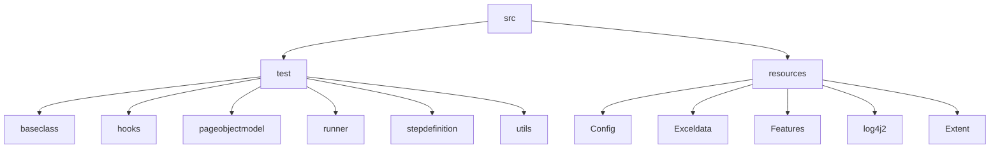

# ds_algo_ninjarico
# Project Title:

DS-Algo (Data Structures and Algorithms) 

# **Project Description:**

The url for DS-Algo project is : https://dsportalapp.herokuapp.com/. DS-Algo project is about various data structures like  Arrays, Linked Lists, Stack, Queue, Tree and Graph. It is an excellent platform for learning data structures in Python. By the end, the user is evaluated by the practice questions. 

# **Tools and Technologies used:**

DS-Algo project is tested with

Selenium WebDriver
Java  
TestNG  
Cucumber   
Log4j2  
Extent Report  
Allure Report  

# **Project Structure:**

# **To run the project through Eclipse:**

Select the file src/test/java/runner/TestRunner.java

Right Click –> Run as –> TestNG Test

# **To view the Reports:**

## *Allure Report*

Allure Report will be generated into the temp folder. To see the report
Go to command prompt

	$ cd <Project Directory>

	$ allure serve allure-results

## *Extent Report*  
Extent Report can be viewed under ”ExtentReports” folder. User is able to  View both Spark Report and PDF Report.

                             
                                                            

		

                             
                                                            

